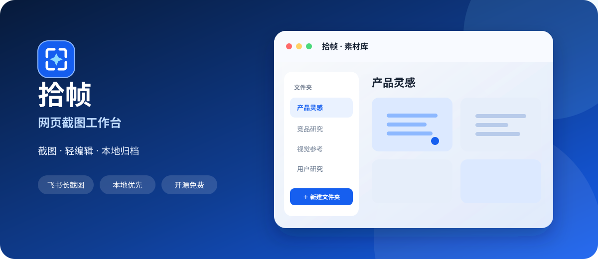
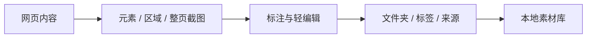

<div align="center">
  
</div>

<div align="center">

[](manifest.json)
[](CHANGELOG.md)
[](LICENSE)
[](PRIVACY.md)

**一个面向知识收集、产品研究和灵感归档的本地优先网页截图插件。**

[安装使用](#安装使用) · [功能说明](#主要功能) · [隐私说明](PRIVACY.md) · [参与贡献](CONTRIBUTING.md)

</div>

## 为什么做拾帧

做产品研究、竞品分析或内容整理时，截图往往散落在下载目录里：没有来源、没有标签，也很难重新找到。

拾帧把这条流程缩短为：



所有截图默认保存在当前浏览器中，不需要注册账号，也不会上传到第三方服务器。

## 主要功能

| 能力 | 说明 |
| --- | --- |
| 多种截图方式 | 支持元素识别、自由区域、当前画面和整页滚动长图 |
| 飞书长截图 | 识别飞书等页面的内部滚动容器，按内容区域滚动拼接 |
| 轻量编辑 | 支持标注框、文字、模糊、裁剪和撤销 |
| 本地素材库 | 保存标题、文件夹、标签、来源链接和截图尺寸 |
| 自定义文件夹 | 支持新建、重命名、删除；删除时安全迁移已有素材 |
| 多种保存体验 | 可选择弹窗式、吸底式或直接保存 |
| 主题与格式 | 支持浅色、深色、跟随系统，以及 PNG / JPG |
| 本地优先 | 图片使用 IndexedDB 保存，元数据保存在扩展本地存储 |

## 安装使用

目前通过 Chrome 开发者模式安装：

1. 下载本仓库：点击 **Code → Download ZIP**，然后解压。
2. 在 Chrome 地址栏打开 `chrome://extensions`。
3. 开启右上角的“开发者模式”。
4. 点击“加载已解压的扩展程序”。
5. 选择包含 `manifest.json` 的 `shizhen` 文件夹。

更新代码后，在扩展管理页点击“拾帧”卡片上的刷新按钮，并刷新正在截图的网页。

## 使用流程

1. 打开希望保存的普通网页。
2. 点击浏览器工具栏中的“拾帧”。
3. 选择元素、区域或整页截图。
4. 在编辑器中修改标题、文件夹和标签。
5. 保存到本地素材库，后续可搜索、下载或打开来源页面。

### 管理文件夹

- 在素材库左侧点击“＋”新建文件夹。
- 鼠标移到文件夹，点击“•••”进行重命名或删除。
- 截图编辑器中的“新建”按钮也可以快速创建文件夹。
- 删除含素材的文件夹时，素材会移动到其他保留文件夹，不会直接丢失。

## 权限与隐私

拾帧只申请完成截图和保存所需的 Chrome 权限：

- `activeTab`、`tabs`、`scripting`：读取当前页面并执行截图交互。
- `storage`、`unlimitedStorage`：保存设置、素材信息和长图数据。
- `downloads`：将截图下载到本机。
- `clipboardWrite`：按设置将截图复制到剪贴板。

项目不包含统计 SDK、广告 SDK 或远程上传服务。完整说明见 [PRIVACY.md](PRIVACY.md)。

## 项目结构

```text
shizhen/
├── manifest.json          # Chrome Manifest V3 配置
├── popup.*                # 截图入口
├── background.js          # 截图调度与滚动拼接
├── content.*              # 页面选择与滚动容器识别
├── editor*                # 弹窗式与吸底式编辑器
├── library.*              # 本地素材库
├── folders.js             # 自定义文件夹数据层
├── asset-db.js            # IndexedDB 图片存储
├── options.*              # 偏好设置
└── assets/                # 品牌资源
```

项目使用原生 HTML、CSS 和 JavaScript，无构建步骤、无运行时依赖。

## 已知限制

- Chrome 内置页面、Chrome Web Store 和部分受保护页面无法注入截图脚本。
- 无限滚动、持续动画或复杂固定定位页面可能出现拼接变化。
- 特别复杂的多栏虚拟化文档建议使用区域截图作为降级方案。
- 当前版本尚未发布到 Chrome Web Store。

## 路线图

- [ ] 导入与导出素材库
- [ ] 自定义快捷键与命名规则
- [ ] 长截图拼接质量检测
- [ ] 批量整理和标签管理
- [ ] Chrome Web Store 正式发布

## 参与贡献

欢迎提交 Issue 和 Pull Request。开始之前请阅读 [CONTRIBUTING.md](CONTRIBUTING.md)。

## 开源协议

本项目基于 [MIT License](LICENSE) 开源。

